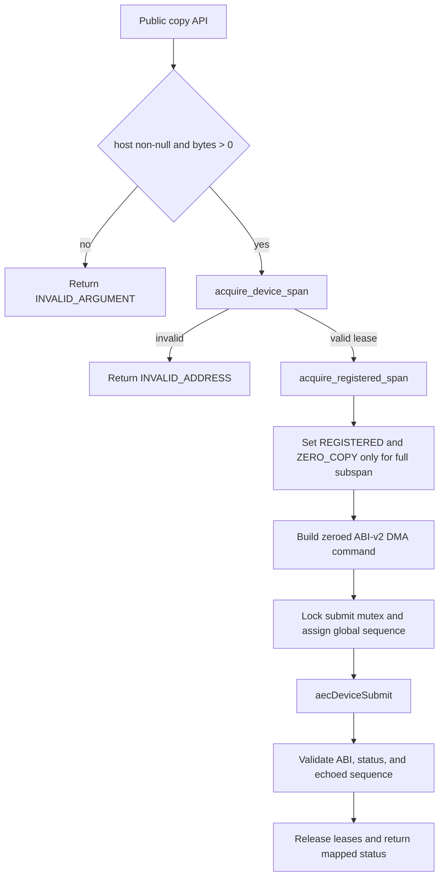
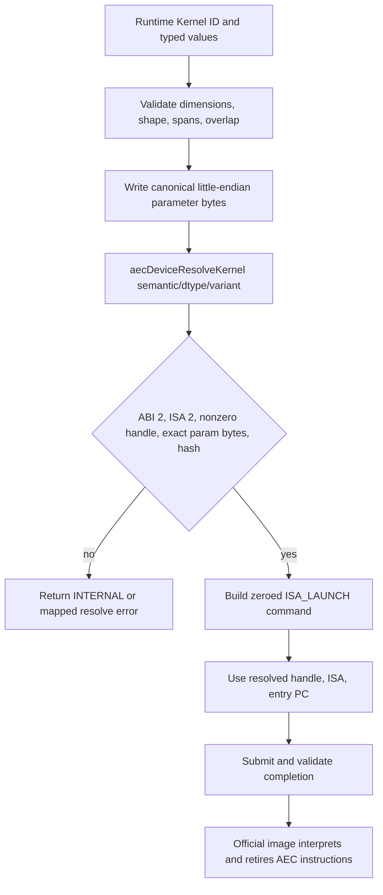
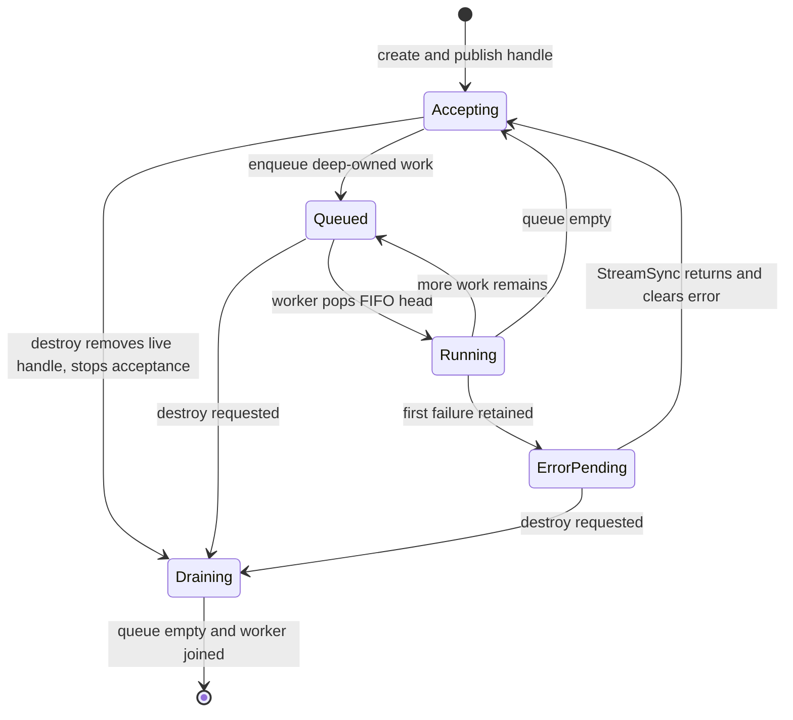
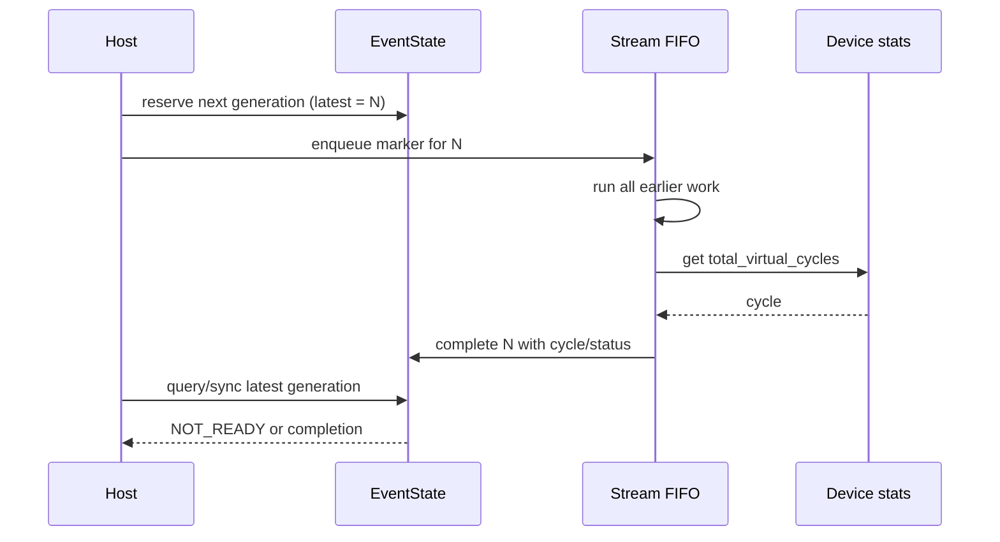
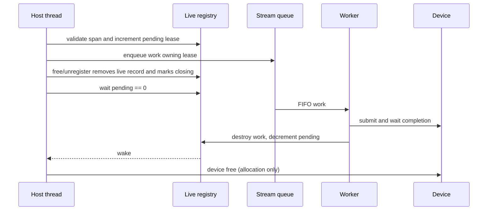

# AEC C2 Runtime Implementation

## Scope and execution contract

This Runtime implements every symbol in `include/aec_runtime.h` for ABI version
2. Numeric results are never computed in host code. Every successful Vector
Add, GEMM, AXPY, DOT, and NRM2 call resolves an official frozen image and sends
an `AEC_DEVICE_OP_ISA_LAUNCH` command to `libaec_device.so`.

The implementation is C++17 behind an exported C ABI. Public functions are thin
exception boundaries in `src/aec_runtime.cpp`; state, validation, serialization,
queueing, and command submission live in focused modules.

## Core invariants

1. `aecDevicePtr` is an opaque 64-bit offset and is never host-dereferenced.
2. Every device span is wholly contained in one live allocation.
3. Span and storage arithmetic is checked before addition or multiplication can overflow.
4. Device command sequence is process-wide, nonzero, and strictly increasing.
5. A successful public call does not clear an older thread-local error.
6. A Runtime Kernel ID is never used as a device handle; resolve is mandatory.
7. Wire parameters are explicit little-endian bytes with no native padding.
8. Every successful numeric operation is an official fixed-image ISA launch.
9. Work in one Stream is FIFO; separate Streams have no synchronization edge.
10. Async launch arguments are materialized before enqueue.
11. Stream/Event handles must exist in a live registry before state access.
12. Destroyed handle addresses are never recycled during the process lifetime.
13. No allocation, registration, Stream, or Event registry mutex is held during device submit.
14. Stats reset changes counters only, not sequence, memory, handles, registrations, or images.
15. Runtime preflight failure submits nothing and therefore retires no instructions.
16. Device faults are returned once and do not poison later valid commands.

## Source responsibilities

| File | Responsibility |
|---|---|
| `src/aec_runtime.cpp` | Exported C ABI, raw C-enum decoding, exception boundaries, device query/stats facade. |
| `src/error.*` | TLS last error, stable names, Device-to-Runtime status mapping. |
| `src/allocation.*` | Live device allocations, exact free, complete-span lookup, pending leases. |
| `src/registration.*` | Exact host intervals, overlap detection, registered-subspan lookup, pending leases. |
| `src/command.*` | Global sequence, serialized submit, completion validation, DMA command construction. |
| `src/copy.*` | Sync/async H2D and D2H preflight, registration flags, queued DMA work. |
| `src/kernel.*` | Dimension validation, image resolve, ISA command construction, all public `aecLaunch` IDs. |
| `src/serialization.h` | Zero-initialized little-endian u32/u64/f32 parameter writer. |
| `src/numeric.*` | Checked GEMM storage, dtype mapping, overlap rules, GEMM work preparation. |
| `src/library_ops.*` | AXPY, DOT, and NRM2 spans, layouts, sync/async work preparation. |
| `src/stream.*` | Tombstone handles, FIFO queue, worker, async error reporting, drain/join. |
| `src/event.*` | Tombstone handles, generations, Stream markers, virtual cycles, elapsed/query/sync. |
| `src/libaec.map` | ELF export allowlist for the public `aec*` ABI. |

## Runtime API to Device ABI mapping

| Runtime API | Device ABI path | Important validation |
|---|---|---|
| `aecDeviceCount`, `aecDeviceInfo` | `aecDeviceGetCaps` | ABI version and public device index. |
| `aecAlloc`, `aecFree` | `aecDeviceAlloc`, `aecDeviceFree` | Nonzero bytes, 64-byte alignment, exact live base, pending references. |
| Sync/async copy | `aecDeviceSubmit(H2D/D2H)` | Host/null/zero, one live allocation, optional full registered interval. |
| `aecLaunch` | `aecDeviceResolveKernel` then `aecDeviceSubmit(ISA_LAUNCH)` | Public ID, exact native args size, dimensions, spans, canonical params. |
| GEMM APIs | Resolve naive typed GEMM, then ISA submit | Shape `[1,256]`, typed storage, three non-overlapping spans. |
| AXPY/DOT/NRM2 | Resolve typed fixed image, then ISA submit | Count, FP32 storage, alias/output rules, exact params. |
| Runtime stats | `aecDeviceGetStats`, `aecDeviceResetStats` | ABI/layout equality; reset does not alter Runtime registries. |
| Fault result | `aecDeviceSubmit` completion | Submit status, completion status, ABI, and sequence must agree. |

## Synchronous copy flow

`src/copy.cpp::copy_sync` owns allocation and optional registration leases for
the full blocking submit. It never holds either registry lock while submitting.

## Allocation and span validation

`src/allocation.cpp` keeps an ordered map from allocation base to a shared
record containing base, size, closing state, pending count, mutex, and condition
variable.

`acquire_device_span(ptr, bytes)` uses `upper_bound(ptr)` to find the only
possible containing allocation. It computes `offset = ptr - base` only after
proving `ptr >= base`, then checks `bytes <= size - offset`. It never evaluates
`ptr + bytes`, so an address near `UINT64_MAX` cannot wrap into a valid range.

`free_device` marks the exact-base record closing and removes it from the live
map before waiting for pending leases. New work then fails lookup while already
accepted work can finish safely. The official allocator remains responsible for
lowest-address first-fit and block coalescing.

## TLS error semantics and C ABI exceptions

`src/error.cpp` stores one `thread_local aecError_t`. `finish` changes it only
for failures. `aecGetLastError` reads and clears; `aecPeekAtLastError` reads
without clearing. Unknown error integers map to the stable string
`AEC_ERROR_UNKNOWN`.

Every status-returning C entry uses `api_boundary`: `std::bad_alloc` becomes
`AEC_ERROR_OUT_OF_MEMORY`, every other C++ exception becomes
`AEC_ERROR_INTERNAL`, and no exception crosses the C ABI.

C callers may pass integers outside a C enum's named values. The affected entry
points copy the raw enum bits into `int` before validation; invalid C values are
therefore handled without invoking C++ invalid-enum undefined behavior.

## Global sequence and command completion

`src/command.cpp::submit_and_validate_completion` owns the only submit mutex and
the next process sequence. Sequence assignment and blocking `aecDeviceSubmit`
occur under the same mutex, preventing two Stream workers from delivering a
larger sequence before a smaller one.

The helper rejects exhaustion instead of wrapping to zero. Every completion
must have Device ABI 2, echo the submitted sequence, and report the same status
as the submit return. Device status mapping is centralized in
`src/error.cpp::map_device_status`.

DMA commands are fully zero-initialized and set direction-specific host/device
fields, legal chunk 65536, queue depth 2, channel 0/1, flags, Stream ID, and
bytes. Stream IDs choose DMA channel by parity, so independent Streams exercise
both channels deterministically.

## Fixed-image resolve and launch

`build_isa_command` preserves caller grid/block for `aecLaunch`. Library APIs
choose their documented grids. All three public GEMM variants are supported;
tiled requires dimensions divisible by 4, vectorized requires divisibility by 8
and 16-byte device offsets. Variant workspace is represented by dynamic shared
bytes (4096 or 8192).

## Canonical parameter layouts

The public `aecLaunch` API accepts exact native structures, including their ABI
padding. Fields are read individually by offset. Only the following packed wire
bytes reach the device:

| Kernel | Wire bytes | Offsets and fields |
|---|---:|---|
| Vector Add FP32 | 32 | `0 A:u64`, `8 B:u64`, `16 C:u64`, `24 count:u64` |
| GEMM | 40 | `0 A:u64`, `8 B:u64`, `16 C:u64`, `24 M:u32`, `28 N:u32`, `32 K:u32`, `36 dtype:u32` |
| AXPY FP32 | 28 | `0 X:u64`, `8 Y:u64`, `16 count:u64`, `24 alpha:f32 bits` |
| DOT FP32 | 32 | `0 X:u64`, `8 Y:u64`, `16 result:u64`, `24 count:u64` |
| NRM2 FP32 | 24 | `0 X:u64`, `8 result:u64`, `16 count:u64` |

`ParameterBlock<64>` starts all bytes at zero and emits each integer least
significant byte first. FP32 is copied to a u32 bit pattern and then emitted
little-endian. Standalone byte tests cover every layout and unused byte.

## GEMM dtype and storage mapping

| Runtime dtype | Input/output storage | Accumulator/output rule delegated to image |
|---|---|---|
| FP4 E2M1 | `ceil(elements/2)` packed for input and output | FP32 accumulation, canonical FP4 conversion. |
| FP8 E4M3/E5M2 | 1 byte/element | FP32 accumulation, format-specific canonical output. |
| FP16/BF16 | 2 bytes/element | FP32 accumulation. |
| FP32 | 4 bytes/element | Ordered FP32 accumulation. |
| FP64 | 8 bytes/element | FP64 accumulation. |
| INT4 | `ceil(elements/2)` input, 4-byte INT32 output | Exact integer sum, saturated INT32. |
| INT8 | 1-byte input, 4-byte INT32 output | Exact integer sum, saturated INT32. |
| INT32 | 4-byte input/output | Exact integer sum, saturated INT32. |

`numeric.cpp::checked_multiply` and `storage_bytes` calculate all spans. The host
does not decode, convert, multiply, reduce, or write numeric results.

## Stream FIFO state machine

Each live Stream owns a mutex, condition variable, deque, worker thread,
accepting/stop flags, in-flight count, and first unreported async error.

The worker releases the final work object and its leases before notifying
waiters. A Stream error does not stop later work; `aecStreamSync` returns and
clears the first retained error, permitting recovery.

The live registry maps an opaque shell pointer to shared state. Shells remain in
a process-lifetime tombstone vector after destroy, so allocator address reuse
cannot make a stale handle name a new Stream.

## Event generation state machine

An Event record reserves a monotonically increasing generation and installs an
incomplete slot before enqueue. Its Stream marker reads official total virtual
cycles only after all earlier FIFO work.

If marker enqueue fails, the generation is marked complete for any concurrent
destroy waiter and latest rolls back to the prior successful record. Destroy
removes the handle from the live registry, disables new records, snapshots the
latest generation, and waits for it. Event shells are tombstones like Streams.

Elapsed cycles read the latest completed generation of each Event, reject
unrecorded/unfinished/reversed intervals, and return zero for the same Event.

## Host registration intervals

`registration.cpp` keeps ordered half-open host intervals. Registration rejects
null, zero, pointer addition overflow, duplicates, containment, and any overlap;
adjacent intervals are legal. Unregister requires the exact base.

A transfer receives REGISTERED and ZERO_COPY only if its entire host span lies
inside one live interval. A partial overlap remains a legal normal DMA transfer.
Registration leases mirror allocation leases, so unregister waits for all prior
async users before returning.

## Async allocation and registration lifetime

Invalid device spans can be queued so async APIs return success and Stream sync
reports the preflight error. Valid spans acquire leases at enqueue time, closing
the race with free/unregister.

## Ownership, locks, and lock order

Ownership rules:

- Allocation/registration records are shared by their live map and active leases.
- Queued work is a shared object captured by one `std::function`; it owns all leases and command bytes.
- Stream/Event state is shared while an API call or marker is in progress.
- Opaque handle shells are process-lifetime tombstones; state is reclaimed after destroy users finish.

Lock order and non-nesting:

1. Allocation registry mutex, then its record mutex.
2. Registration registry mutex, then its record mutex.
3. Stream registry lookup releases before the Stream-state mutex is acquired.
4. Event registry lookup releases before the Event-state mutex is acquired.
5. Event generation reservation releases before Stream enqueue.
6. Device submit mutex is acquired only after all registry lookups and leases.

Lease release takes only its record mutex. No path holds a registry or
Stream/Event mutex while waiting in `aecDeviceSubmit`.

## Fault propagation and recovery

The submit helper maps injected device faults to `AEC_ERROR_DEVICE` and ISA traps
to `AEC_ERROR_ISA_TRAP`. It validates completion even on failure. Stream workers
store the first unreported error but continue running later FIFO items, allowing
the one-shot fault to be followed by a successful command. Sync returns and
clears the stored error.

Tests cover NEXT_DMA, NEXT_KERNEL, and NEXT_COMMAND followed immediately by a
valid matching command and data/ISA evidence.

## Stats and accounting

Runtime stats mirror `aecDeviceStats` exactly. The Device is the authority for
submitted/DMA/kernel/zero-copy/channel counts, cycles, ISA launches, retired
instructions, traps, handle, and trace digest. Runtime never invents counters.

Preflight errors happen before submit, leaving the full stats object unchanged.
Stats reset invokes only `aecDeviceResetStats`; allocation, registration,
sequence, handle tombstones, and resolved image handles remain usable.

## Agent policies

The DMA Agent validates the exact schema and selects:

- chunk 1048576, which minimizes chunk overhead without a model penalty;
- queue depth 2 when concurrency is at least 2, otherwise 1;
- zero-copy exactly for registered input;
- channel 0 for H2D and 1 for D2H.

This matched the minimum over every legal action for 120 input combinations.

The Kernel Agent validates candidates, filters by alignment, workspace, and
M/N/K divisibility, and never constructs an ID. If all legal candidates include
public diagnostic cycles it selects the minimum. Otherwise it selects the
highest legal variant. The offline oracle collector evaluated 5,570,560 legal
candidate records over all 10 dtypes and every multi-candidate shape in
`M/N/K=[1,256]`; it found zero dominance violations, zero mismatches, and zero
regret. Alignment/workspace probes established that values above each legal
threshold do not change successful completion cycles.

Both Agents use only Python standard library, emit exactly one compact JSON to
stdout on valid input, emit no logs, keep no state, and reject invalid/no-legal
input with a nonzero exit. The Kernel Agent contains a small self-contained JSON
codec so process-level p99 remains below 20 ms without relaxing strict parsing,
Unicode escaping, or output purity. It does not import `ctypes`, load the device
library, read external files, invoke subprocesses, or access the network.

Oracle collection and policy generation are pre-submission tools only. They are
not copied into the three-file scoring artifact.

## Development provenance and dependencies

Codex/large-language-model assistance was used for implementation, test design,
review, and documentation. The submitted code remains reviewable source under
team responsibility; no third-party implementation was copied. Runtime code
depends only on the C++17 standard library, pthreads, and the organizer-supplied
`libaec_device.so`. Agent code depends only on the Python standard library and
operates offline. The oracle certificate uses only the organizer's published,
read-only evaluator and contains no hidden cases or hidden outputs.

## Known limitations and residual risk

- The released grader exposes only `public`; hidden Agent speedup and the Excellent gate cannot be verified locally.
- Tiled speedup is oracle-optimal but ranges from about 1.421x to 1.666x;
  therefore some legal small tiled shapes have a performance fraction below
  1 even though no alternative candidate is faster. Hidden 6/6 depends on the
  organizer's undisclosed performance-case selection.
- Stream device submits are globally serialized to preserve strict sequence. This affects host wall-clock concurrency, not scored virtual cycles.
- Handle tombstones consume a small amount of memory until process exit by design; they prevent stale-pointer aliasing.
- Runtime registries assume callers do not invoke the private Device reset API behind the Runtime. That function is not part of the public Runtime ABI.
- Host registration models flags and lifetime; it does not pin physical pages because the platform is a virtual device.
- Hidden maximum-shape GEMM, unusual cross-Stream Event, and special floating-point cases remain residual risk despite focused public/custom coverage. DOT/NRM2 maximum count is covered on the updated official device.
